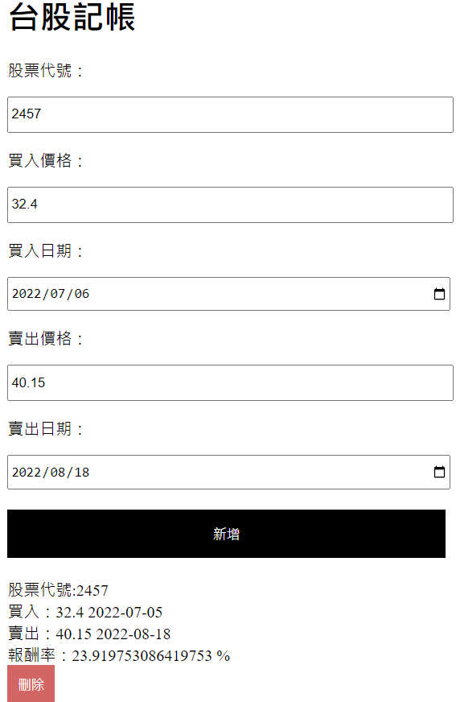
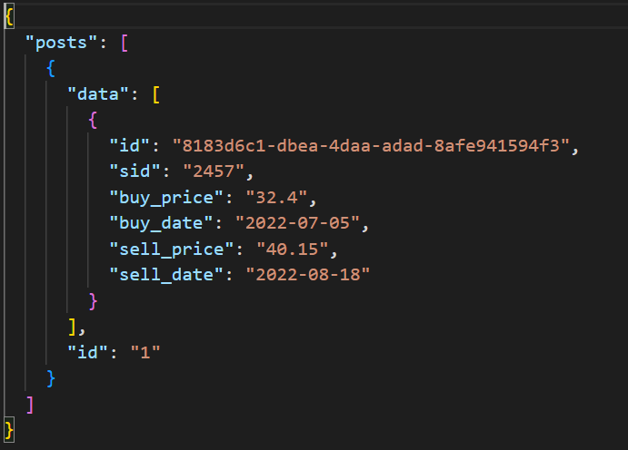

# 此專案為記錄react之過程
[學習筆記記錄在這裡](筆記.md)
主要以hook實作Todo list練習

# 學習網址
https://www.youtube.com/watch?v=zqV7NIFGDrQ&t=7872s

# 使用
```js
git clone https://github.com/samwang1228/react-practise.git
cd react-pratise
npm install //下載有使用到的套件
npm run server //開啟後端
npm start 
```

# 結果
Frontend(react)



Backend(json server)

